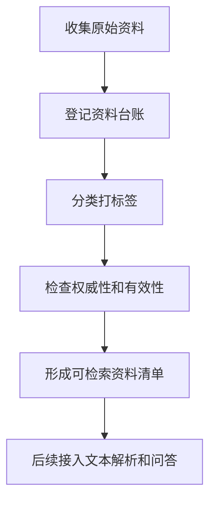

# 电力政策知识库开始使用

这个知识库先按“可人工维护、后续可自动化”的方式建设。第一阶段不用急着写复杂程序，先把资料、台账、标签和权重规则跑顺。

## 1. 文件夹用途

```text
00_说明
  放知识库建设说明、流程图、口径说明。

01_原始资料
  放原始 PDF、Word、网页截图、公众号文章导出文件等。
  官方政策、交易规则、解读资料、咨询报告要分开放。

02_元数据
  放资料台账。每收一份资料，就登记标题、部门、日期、地区、主题、来源类型等。

03_处理后文本
  后续把 PDF、Word、网页内容解析成纯文本后放这里。

04_标签与权重
  放标签体系、权威等级、时间权重和排序规则。

05_输出成果
  放政策清单、专题综述、地区对比、问答结果等输出材料。

scripts
  后续放自动解析、入库、检索、问答相关脚本。
```

## 2. 每收一份资料时怎么做

1. 把原始文件放进 `01_原始资料` 对应子目录。
2. 在 `02_元数据/政策资料台账.csv` 里登记一行。
3. 给资料标注来源类型、权威等级、适用地区、主题标签、有效状态。
4. 如果是解读文章或咨询材料，要写明它对应的官方政策文件。
5. 如果发现新版本、废止、替代关系，在备注里记录。

## 3. 第一阶段建议目标

先不要追求全量覆盖。建议先做一个小闭环：

```text
地区范围：全国 + 1 到 3 个重点省份
主题范围：中长期、现货、辅助服务、省内交易、省间交易
资料规模：先整理 50 到 100 份高价值资料
输出目标：能按地区、主题、时间、权威等级查资料
```

## 4. 推荐工作顺序



## 5. 当前阶段最重要的原则

- 官方政策原文是主依据。
- 交易规则和实施细则是业务执行依据。
- 公众号、咨询机构、行业报告只能作为辅助解读。
- 每一条结论都尽量能追溯到原文链接、文件名、发布日期和具体条款。
- 时间越新的资料不一定越权威，排序时要同时看相关性、权威性、有效性和时效性。
