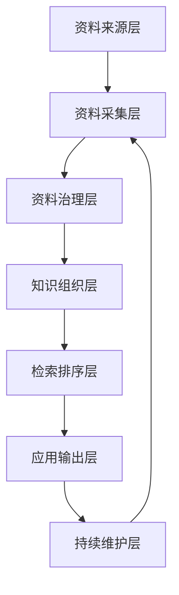

# 知识库整体框架

## 总体思路

电力政策知识库不是简单堆文件，而是把政策原文、交易规则、官方解读、第三方资料统一整理成一个可查询、可比较、可追溯、可持续更新的知识体系。



## 七层框架

| 层级 | 主要内容 | 关键问题 |
|---|---|---|
| 资料来源层 | 国家能源局、发改委、工信部门、能源监管局、省级部门、交易中心、公众号、咨询机构 | 资料从哪里来 |
| 资料采集层 | 下载 PDF、保存网页、整理公众号文章、收集报告 | 原始资料是否留痕 |
| 资料治理层 | 去重、分类、打标签、标地区、标有效性、标权威等级 | 资料是否可信可用 |
| 知识组织层 | 文件级、条款级、主题级、关系级整理 | 能否按业务理解 |
| 检索排序层 | 相关性、权威性、有效性、地区匹配、时间权重 | 搜出来谁排前面 |
| 应用输出层 | 政策清单、条款引用、政策摘要、地区对比、专题报告 | 最终解决什么问题 |
| 持续维护层 | 新政策补充、废止状态更新、标签修正、版本关系维护 | 知识库是否长期可靠 |

## 默认检索排序口径

```text
综合排序 =
内容相关性
+ 来源权威性
+ 是否现行有效
+ 地区匹配度
+ 主题匹配度
+ 分类型时间权重
```

默认展示时，应优先展示官方有效文件，再补充近期解读资料。
